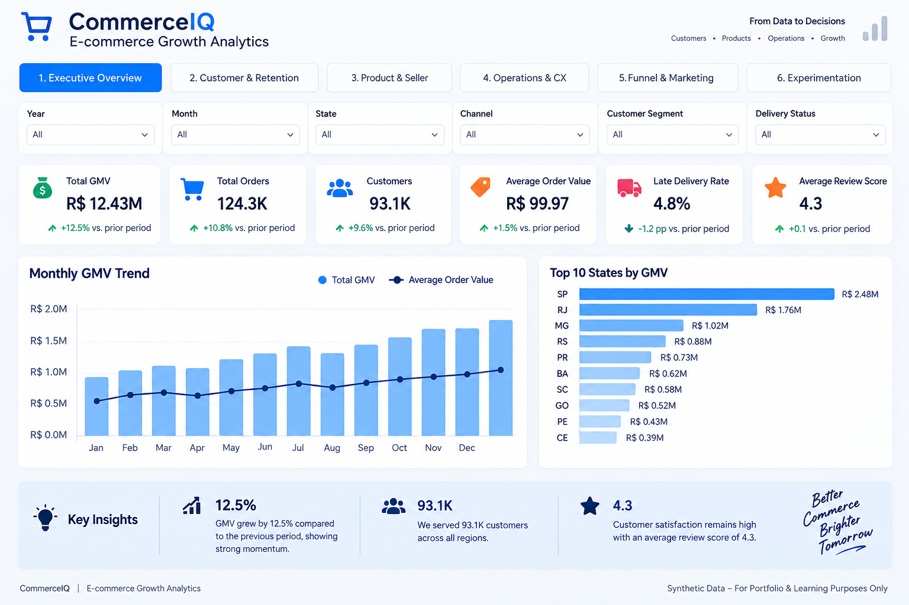
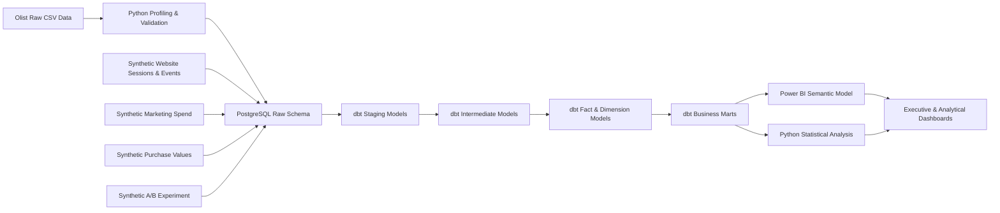

<div align="center">

# 🛒 CommerceIQ
### E-commerce Growth & Experimentation Analytics Platform

**Turning raw e-commerce data into decision-ready business insights — from database to boardroom.**

[](https://www.python.org/)
[](https://www.postgresql.org/)
[](https://www.getdbt.com/)
[](https://powerbi.microsoft.com/)
[](#)
[](#)

</div>

---

## 📖 Overview

**CommerceIQ** is an end-to-end analytics engineering project that simulates how a modern e-commerce analytics team builds a **reusable decision-support platform** — starting from raw transactional data and ending in an executive-facing Power BI dashboard.

It combines **Python, PostgreSQL, advanced SQL, dbt, customer analytics, funnel analytics, marketing analytics, A/B testing, and Power BI** into a single, coherent analytics lifecycle:

> **Raw data → Validated warehouse → Analytics engineering → Statistical analysis → BI → Business decisions**

This isn't just a dashboard — it's a full analytics system built to answer real business questions across **Customer, Product, Operations, Growth, and Experimentation**.

<div align="center">


<sub><i>Executive Overview page — Power BI dashboard (synthetic data, for portfolio purposes)</i></sub>
</div>

---

## 📌 Table of Contents

- [Business Questions Answered](#-business-questions-answered)
- [Analytics Architecture](#️-analytics-architecture)
- [Data Sources](#-data-sources)
- [Tech Stack](#️-tech-stack)
- [dbt Modeling Strategy](#-dbt-modeling-strategy)
- [Data Quality & Testing](#-data-quality--testing)
- [Key Findings](#-key-analytical-findings)
- [A/B Testing & Experimentation](#-ab-testing--experimentation)
- [Power BI Dashboard](#-power-bi-dashboard)
- [Repository Structure](#-repository-structure)
- [How to Run](#️-how-to-run-the-project)
- [Skills Demonstrated](#-skills-demonstrated)
- [Limitations](#️-limitations)
- [Future Enhancements](#-future-enhancements)
- [Author](#-author)

---

## 🎯 Business Questions Answered

<table>
<tr><td width="20%"><b>📊 Executive</b></td><td>How are orders & GMV trending? What's the AOV? Which regions drive the most GMV?</td></tr>
<tr><td><b>👥 Customer</b></td><td>How many customers return? Which segments are most valuable? What does cohort retention look like?</td></tr>
<tr><td><b>📦 Product & Seller</b></td><td>Which categories drive GMV? Is seller GMV concentrated? Which categories carry the highest freight burden?</td></tr>
<tr><td><b>🚚 Operations & CX</b></td><td>How strongly do late deliveries correlate with poor reviews? Which states/sellers carry the most delivery risk?</td></tr>
<tr><td><b>📈 Growth & Marketing</b></td><td>Where does the funnel leak users? Which channels convert best and deliver the strongest ROAS?</td></tr>
<tr><td><b>🧪 Experimentation</b></td><td>Does an improved checkout increase conversion — and is the effect statistically significant?</td></tr>
</table>

---

## 🏗️ Analytics Architecture



---

## 🗂️ Data Sources

| Source | Description |
|---|---|
| **Olist Brazilian E-Commerce Dataset** | ~99K orders, ~96K customers, ~112K order items, plus geography, products, sellers, payments, and reviews (2016–2018). Core trend KPIs use **Jan 2017 – Aug 2018** for reliability. |
| **Synthetic Digital Analytics Layer** | Website sessions, funnel events, acquisition channels, marketing spend, purchase values, and A/B experiment data — generated to fill the gaps the public dataset doesn't cover. Clearly labeled throughout the project. |

> ⚠️ Transactional Olist insights are **observational**. The synthetic A/B experiment is randomized *within the simulation*, so it supports a **causal conclusion inside that simulation only**.

---

## 🛠️ Tech Stack

| Layer | Technology |
|---|---|
| Programming | Python |
| Data Analysis | Pandas, NumPy |
| Statistical Testing | SciPy |
| Database | PostgreSQL |
| Querying | Advanced SQL |
| Analytics Engineering | dbt Core |
| Data Modeling | Star Schema / Dimensional Modeling |
| BI & Visualization | Power BI |
| Measures | DAX |
| Version Control | Git / GitHub |
| Development | VS Code |

---

## 🔄 Project Workflow

```text
Raw Data → Profiling & QA → PostgreSQL Raw Layer → dbt Staging → dbt Intermediate
   → Fact & Dimension Models → Business Marts → Customer/Product/Ops/Growth Analytics
   → A/B Experiment Analysis → Power BI Executive Dashboard → Business Recommendations
```

---

## 🧱 dbt Modeling Strategy

A layered, star-schema analytics-engineering architecture:

<details>
<summary><b>Staging Layer</b> — standardize, clean, and type-cast raw sources</summary>

```text
stg_orders · stg_customers · stg_order_items · stg_products · stg_payments
stg_reviews · stg_sellers · stg_geolocation · stg_category_translation
stg_website_sessions · stg_website_events · stg_marketing_spend
stg_website_purchases · stg_experiment_checkout · stg_experiment_results
```
</details>

<details>
<summary><b>Intermediate Layer</b> — enriched, reusable business logic</summary>

```text
int_order_items_enriched · int_order_payments · int_order_items_summary
int_latest_order_review · int_orders_enriched · int_customer_cohorts
int_customer_cohort_activity · int_session_funnel · int_website_purchases_enriched
```
</details>

<details>
<summary><b>Facts & Dimensions</b> — the star schema core</summary>

**Facts:** `fct_orders` · `fct_order_items`
**Dimensions:** `dim_customers` · `dim_products` · `dim_sellers` · `dim_date`
</details>

<details>
<summary><b>Business Marts</b> — analytics-ready aggregates by domain</summary>

| Domain | Marts |
|---|---|
| Executive & Customer | `agg_monthly_kpis`, `agg_customer_metrics`, `agg_customer_rfm(_scored)`, `agg_customer_segments`, `agg_cohort_retention`, `agg_customer_ltv`, `agg_segment_ltv` |
| Product & Seller | `agg_category_performance`, `agg_seller_performance`, `agg_seller_concentration`, `agg_category_freight_economics` |
| Operations & CX | `agg_delivery_experience`, `agg_state_delivery_performance`, `agg_seller_delivery_performance`, `agg_category_delivery_performance`, `agg_order_seller_complexity`, `agg_multi_item_seller_experience` |
| Funnel | `agg_funnel_overview`, `agg_funnel_by_device`, `agg_funnel_by_channel`, `agg_monthly_funnel`, `agg_funnel_dropoff` |
| Marketing | `agg_marketing_channel_performance`, `agg_marketing_funnel_performance`, `agg_monthly_marketing_performance`, `agg_marketing_roas` |
| Experimentation | `agg_experiment_variant_performance`, `agg_experiment_summary`, `agg_experiment_decision` |

</details>

---

## 🧪 Data Quality & Testing

Rigorous validation across the pipeline: primary-key checks, uniqueness, not-null, accepted values, relationships, source reconciliation, funnel consistency, experiment reconciliation, cohort completeness, delivery-timing validation, and business-rule tests.

<div align="center">

| ✅ PASS | ⚠️ WARN | ❌ ERROR | ⏭️ SKIP | **TOTAL** |
|:---:|:---:|:---:|:---:|:---:|
| **480** | **1** | **0** | **0** | **481** |

</div>

*The single warning is intentionally retained for known missing product metadata (`product_photos_qty`) in the source data.*

---

## 📈 Key Analytical Findings

**1️⃣ Customer retention is low** — of ~93,104 reliable delivered-order customers, only ~2,789 are repeat buyers → a **~3% repeat rate**, suggesting a low-frequency purchase marketplace.

**2️⃣ Repeat customers are far more valuable** — LTV proxy of **~R$260** vs **~R$138** for one-time buyers → repeat customers generate **~1.9× the value**.

**3️⃣ RFM segmentation** surfaces actionable segments: *Champions, Loyal Repeat, High-Value Recent, At-Risk High Value, Promising, Hibernating, Regular.*

**4️⃣ Product GMV is concentrated** — top 5 categories drive **~40% of GMV**; top 10 drive **~62%**.

**5️⃣ Seller GMV is highly diversified** — the top seller accounts for only **~1.7%** of GMV; top 20 sellers combined reach **~21.3%**.

**6️⃣ Late delivery strongly correlates with poor reviews** — average score drops from **4.29 → 3.53**, and low-rating rate jumps from **9.2% → 25.1%** (a **2.7× risk increase**).

**7️⃣ Regional risk varies** — São Paulo pairs high volume with strong delivery performance; Rio de Janeiro pairs high volume with elevated late-delivery exposure.

**8️⃣ Multi-seller orders hurt experience** — low-rating rate rises from **~21%** (single-seller) to **~47%** (multi-seller) → a **~2.2× risk ratio**.

**9️⃣ Funnel bottleneck** — across 120K synthetic sessions (~59,815 unique visitors), the biggest drop-off is **Product View → Add to Cart (~24.7%)**, with overall session-to-purchase at **~6.5%**.

**🔟 Marketing efficiency** — Email leads with the lowest cost per purchase (**R$64.86**) and highest ROAS (**~2.30×**), ahead of Social and Paid Search.

> All observational findings (delivery, complexity, geography) are framed as **associations, not causal claims** — see [Limitations](#️-limitations).

---

## 🧪 A/B Testing & Experimentation

**Question:** Does an improved checkout experience increase checkout-to-purchase conversion?

| Metric | Value |
|---|---|
| Randomization unit | Visitor |
| Eligible visitors | 11,706 (Control: 5,865 · Treatment: 5,841) |
| SRM check | p ≈ 0.8245 → **no mismatch detected** |
| Control conversion | 60.84% |
| Treatment conversion | 64.73% |
| Absolute uplift | **+3.90 pp** |
| Relative uplift | **+6.41%** |
| z-statistic / p-value | z ≈ 4.36, p ≈ 0.000013 |
| 95% confidence interval | +2.15 pp to +5.65 pp |
| Projected impact @ 100K visitors | **~3,897 incremental purchases** (95% CI: 2,147–5,646) |
| **Final decision** | ✅ **Recommend Treatment** |

Because the experiment was randomized synthetically, this conclusion is **causal within the simulation**.

---

## 📊 Power BI Dashboard

A **6-page executive analytics report**:

1. **Executive Overview** — GMV, orders, AOV, active customers, review score, late-delivery rate, trends
2. **Customer & Retention** — repeat rate, LTV proxy, RFM segments, cohort-retention heatmap
3. **Product & Seller** — category GMV, seller concentration, freight economics
4. **Operations & CX** — late-delivery impact, state/seller delivery risk, multi-seller complexity
5. **Funnel & Marketing** *(synthetic)* — conversion funnel, channel performance, ROAS, cost per purchase
6. **Experimentation** *(synthetic)* — control vs. treatment, uplift, significance, projected impact

```text
powerbi/CommerceIQ_Ecommerce_Growth_Analytics.pbix
```

---

## 📁 Repository Structure

```text
ecommerce-growth-analytics/
│
├── data/
│   ├── raw/
│   └── synthetic/
│
├── scripts/
│   ├── generate_clickstream.py
│   ├── generate_marketing_spend.py
│   ├── generate_website_purchases.py
│   ├── generate_experiment_data.py
│   ├── analyze_experiment_conversion.py
│   ├── check_experiment_srm.py
│   └── load_synthetic_to_postgres.py
│
├── ecommerce_dbt/
│   ├── models/
│   │   ├── staging/
│   │   ├── intermediate/
│   │   └── marts/
│   ├── tests/
│   ├── dbt_project.yml
│   └── packages.yml
│
├── powerbi/
│   ├── CommerceIQ_Ecommerce_Growth_Analytics.pbix
│   └── screenshots/
│
├── .env.example
├── requirements.txt
├── README.md
└── .gitignore
```

---

## 🧠 Skills Demonstrated

<table>
<tr><td><b>SQL & Analytics Engineering</b></td><td>Complex joins, CTEs, window functions, dimensional modeling, dbt testing, business marts</td></tr>
<tr><td><b>Python</b></td><td>Data profiling & validation, synthetic data generation, experiment analysis, statistical testing</td></tr>
<tr><td><b>Customer Analytics</b></td><td>RFM segmentation, cohort analysis, retention, LTV proxy</td></tr>
<tr><td><b>Product & Marketplace Analytics</b></td><td>Category performance, seller concentration & risk, freight economics</td></tr>
<tr><td><b>Growth Analytics</b></td><td>Funnel analysis, conversion metrics, channel performance, cost per purchase, ROAS</td></tr>
<tr><td><b>Experimentation</b></td><td>Randomized design, power/sample-size reasoning, SRM testing, two-proportion z-test, CIs</td></tr>
<tr><td><b>Power BI</b></td><td>Star-schema modeling, DAX, KPI cards, cohort heatmaps, funnel charts, dashboard storytelling</td></tr>
</table>

---

## ⚠️ Limitations

- Olist is a historical public dataset — not a live production business.
- Digital funnel, marketing, purchase-value, and experiment datasets are **synthetic**.
- GMV ≠ company revenue (no fee/commission data available).
- LTV is a **proxy** based on GMV, not contribution margin.
- Marketing "cost per purchase" ≠ true CAC.
- Observational relationships (delivery, complexity, geography) are **not causal claims**.
- The experiment's causal conclusion holds **only within the synthetic simulation**.
- No real-time streaming infrastructure is currently implemented.

---

## 🚀 Future Enhancements

- BigQuery cloud warehouse migration
- Airflow orchestration & Dockerized environment
- Automated CI/CD for dbt, incremental models
- Customer churn modeling & recommendation-system analytics
- Anomaly detection for marketplace KPIs
- Attribution modeling & automated experiment monitoring
- Power BI cloud deployment

---

## 👤 Author

**Satyam soni**
*MS in Artificial Intelligence & Data Science — ABV-IIITM Gwalior*

Target roles: **Data Analyst · Business Analyst · Product Analyst · Growth Analyst · Analytics Engineer · Data Science / AI**

---

